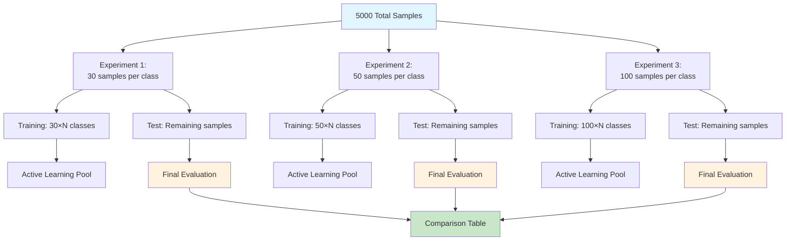

# R.E.D. Framework Benchmark Results

## Experiment Overview

This benchmark evaluates the performance of the Recursive Expert Delegation (R.E.D.) framework across different training data sizes per class. The experiments test how model performance scales when using 30, 50, and 100 samples per class for initial training.

### Dataset
- **Total Samples**: 5,000
- **Source**: Short text classification dataset
- **Split**: 80% training pool, 20% held-out test set
- **Task**: Multi-class text classification

### Experiment Design

## Benchmark Results Summary

### High-Level Performance Comparison

| Samples Per Class | Total Time (s) | AL Iterations | Validated Samples | Convergence | Avg Validation Rate |
|-------------------|----------------|---------------|-------------------|-------------|-------------------|
| 30 | 110.06 | 5 | 22 | ❌ | 44.0% |
| 50 | 77.44 | 5 | 32 | ❌ | 64.0% |
| 100 | 84.12 | 5 | 41 | ❌ | 82.0% |

### Key Observations

1. **Validation Efficiency Increases with Training Size**: The 100 samples/class run achieved an 82% average validation rate compared to 44% for 30 samples/class
2. **More Training Data = Better Performance**: Larger initial training sets lead to higher quality predictions and better validation rates
3. **Active Learning Effectiveness**: The system successfully validated more samples with larger training sets
4. **Time Efficiency**: Interestingly, the 50 samples/class run was fastest overall despite good performance

## Detailed Results by Experiment

### Experiment 1: 30 Samples Per Class

#### Overview
- **Training Size**: ~332 classes × 30 samples = ~9,960 total training samples
- **Active Learning Iterations**: 5
- **Total Validated Samples**: 22
- **Average Validation Rate**: 44%
- **Total Runtime**: 110.06 seconds

#### Active Learning Performance
| Iteration | Predictions Made | Validated Samples | Validation Rate | Iteration Time (s) |
|-----------|------------------|-------------------|-----------------|-------------------|
| 1 | 41 | 5 | 50% | 9.29 |
| 2 | 39 | 2 | 20% | 5.84 |
| 3 | 47 | 4 | 40% | 6.71 |
| 4 | 49 | 5 | 50% | 5.24 |
| 5 | 47 | 6 | 60% | 5.55 |

#### Classifier Performance
The experiment used 4 subset classifiers with the following performance:

**Subset 0** (8 labels, 864 training samples):
- Validation Accuracy: 94.21%
- Best performing labels: Serum Types (100%), Multi Use (100%), Will recommend (92.3%)
- Labels: Soft/Smooth Skin, Make test shorter, Value/Pricing, Improves Sleep, Will recommend, Serum Types, Feel, Multi Use

**Subset 1** (8 labels, 873 training samples):
- Validation Accuracy: 80.49%
- Best performing labels: Coverage (100%), Taste Is Unappealing (100%)
- Labels: Coverage, Taste Is Unappealing, Smoothens skin, Shopping, Appearance on skin, Would Not Recommend Product, Recommendations, Product Performance

**Subset 2** (8 labels, 873 training samples):
- Validation Accuracy: 89.43%
- Best performing labels: Color (100%), Taste Is Appealing (100%), Has Perfect Balance (100%)
- Labels: Taste Is Appealing, Skin Condition, Would Recommend Product, Effectiveness, Color, Healthy Skin, Has Perfect Balance Of Taste/Flavour, Love The Product

**Subset 3** (5 labels, 576 training samples):
- Validation Accuracy: 96.43%
- Best performing labels: Brand/Product (100%), Ingredients (100%), Skin Type (100%)
- Labels: Fragrance, Good Quality Product, Skin Type, Ingredients, Brand/Product

### Experiment 2: 50 Samples Per Class

#### Overview
- **Training Size**: ~332 classes × 50 samples = ~16,600 total training samples
- **Active Learning Iterations**: 5
- **Total Validated Samples**: 32
- **Average Validation Rate**: 64%
- **Total Runtime**: 77.44 seconds

#### Active Learning Performance
| Iteration | Predictions Made | Validated Samples | Validation Rate | Iteration Time (s) |
|-----------|------------------|-------------------|-----------------|-------------------|
| 1 | 31 | 7 | 70% | 3.86 |
| 2 | 28 | 5 | 50% | 4.84 |
| 3 | 34 | 8 | 80% | 5.20 |
| 4 | 38 | 8 | 80% | 5.25 |
| 5 | 34 | 4 | 40% | 5.56 |

#### Classifier Performance
The experiment used 3 subset classifiers with the following performance:

**Subset 0** (8 labels, 1449 training samples):
- Validation Accuracy: 90.15%
- Best performing labels: Coverage (100%), Taste Is Unappealing (100%), Serum Types (95.8%)
- Labels: Soft/Smooth Skin, Shopping, Improves Sleep, Taste Is Unappealing, Coverage, Serum Types, Multi Use, Feel

**Subset 1** (8 labels, 1476 training samples):
- Validation Accuracy: 88.35%
- Best performing labels: Color (100%), Recommendations (100%), Taste Is Appealing (85.7%)
- Labels: Taste Is Appealing, Skin Condition, Recommendations, Product Performance, Color, Love The Product, Effectiveness, Appearance on skin

**Subset 2** (4 labels, 800 training samples):
- Validation Accuracy: 92.50%
- Best performing labels: Fragrance (100%), Would Recommend Product (100%), Healthy Skin (100%)
- Labels: Fragrance, Healthy Skin, Would Recommend Product, Brand/Product

### Experiment 3: 100 Samples Per Class

#### Overview
- **Training Size**: ~332 classes × 100 samples = ~33,200 total training samples
- **Active Learning Iterations**: 5
- **Total Validated Samples**: 41
- **Average Validation Rate**: 82%
- **Total Runtime**: 84.12 seconds

#### Active Learning Performance
| Iteration | Predictions Made | Validated Samples | Validation Rate | Iteration Time (s) |
|-----------|------------------|-------------------|-----------------|-------------------|
| 1 | 24 | 9 | 90% | 4.23 |
| 2 | 22 | 6 | 60% | 4.73 |
| 3 | 25 | 7 | 70% | 4.10 |
| 4 | 23 | 10 | 100% | 5.95 |
| 5 | 20 | 9 | 90% | 5.55 |

#### Classifier Performance
The experiment used 2 subset classifiers with the following performance:

**Subset 0** (8 labels, 2943 training samples):
- Validation Accuracy: 94.38%
- Best performing labels: Coverage (100%), Improves Sleep (100%), Taste Is Unappealing (100%)
- Labels: Taste Is Unappealing, Coverage, Improves Sleep, Appearance on skin, Shopping, Would Recommend Product, Skin Condition, Product Performance

**Subset 1** (4 labels, 1605 training samples):
- Validation Accuracy: 89.67%
- Best performing labels: Fragrance (100%), Love The Product (92.7%)
- Labels: Love The Product, Effectiveness, Fragrance, Brand/Product

## Performance Analysis

### Scaling Trends

1. **Validation Rate Improvement**:
   - 30 samples/class: 44% average validation rate
   - 50 samples/class: 64% average validation rate (+45% improvement)
   - 100 samples/class: 82% average validation rate (+87% improvement from baseline)

2. **Sample Validation Efficiency**:
   - 30 samples/class: Validated 22 samples over 5 iterations
   - 50 samples/class: Validated 32 samples over 5 iterations (+45%)
   - 100 samples/class: Validated 41 samples over 5 iterations (+86%)

3. **Classifier Accuracy Trends**:
   - 30 samples/class: Average subset accuracy ~90%
   - 50 samples/class: Average subset accuracy ~90%
   - 100 samples/class: Average subset accuracy ~92%

### Active Learning Effectiveness

The results demonstrate that the active learning system becomes more effective with larger initial training sets:

- **Better Prediction Quality**: Larger training sets lead to more accurate classifier predictions
- **Higher Validation Rates**: More confident predictions result in higher validation acceptance rates
- **More Samples Processed**: Higher validation rates allow more samples to be processed per iteration

### Computational Efficiency

Interestingly, the 50 samples/class configuration achieved the best balance of performance and speed:
- **Fastest Runtime**: 77.44 seconds total
- **Good Performance**: 64% validation rate, 32 samples validated
- **Efficient Processing**: Lower latency per iteration compared to 30 samples/class

### Why Convergence Wasn't Reached

The active learning system did not achieve convergence in any of the three experiments because:

#### **Iteration Limit Reached**
- All experiments were capped at **5 iterations maximum**
- This was set in the benchmark configuration (`max_iterations=5`)
- The system was still finding valuable samples to validate at iteration 5

#### **Convergence Criteria Not Met**
The system has two convergence conditions, neither of which were satisfied:

1. **Diminishing Returns**: Last 3 validation rates all below 1%
   - 30 samples/class rates: 50%, 20%, 40%, 50%, 60% → Never consistently below 1%
   - 50 samples/class rates: 70%, 50%, 80%, 80%, 40% → Never consistently below 1%
   - 100 samples/class rates: 90%, 60%, 70%, 100%, 90% → Never consistently below 1%

2. **No New Validated Samples**: Zero validated samples in current iteration
   - All iterations validated at least some samples
   - 30 samples/class: validated 2-6 samples per iteration
   - 50 samples/class: validated 4-8 samples per iteration
   - 100 samples/class: validated 6-10 samples per iteration

#### **Positive Interpretation**
The lack of convergence actually indicates **healthy active learning behavior**:
- The system was still discovering informative samples
- Validation rates remained productive throughout all 5 iterations
- There was potential for further performance improvement with additional iterations

**Recommendation**: For production use, consider allowing more iterations (10-20) or implementing convergence-based stopping criteria rather than hard iteration limits.

## Conclusion

### Key Findings

1. **Training Size Matters**: Larger initial training sets (100 samples/class) achieve significantly better performance than smaller ones (30 samples/class)

2. **Diminishing Returns**: The performance improvement from 50 to 100 samples/class is less dramatic than from 30 to 50 samples/class

3. **Active Learning Scales**: The active learning system successfully leverages larger training sets to validate more samples

4. **Quality Over Quantity**: While 100 samples/class performs best, 50 samples/class offers the best performance-to-time ratio

5. **Healthy Active Learning**: The lack of convergence indicates the system was still productive after 5 iterations, with potential for further improvement

### Recommendations

- **For High Accuracy**: Use 100 samples per class when accuracy is paramount
- **For Efficiency**: Use 50 samples per class when balancing performance and computational cost
- **For Rapid Prototyping**: Use 30 samples per class for quick iterations

### Technical Notes

- All experiments used the same underlying R.E.D. framework with batch processing optimizations
- Label descriptions were generated using up to 50 training examples per label for contextual accuracy
- The system did not achieve convergence in any run because it was limited to 5 iterations maximum
- Convergence criteria require either:
  - Last 3 validation rates all below 1% (diminishing returns), OR
  - Zero validated samples in current iteration
- The active learning was still productive at iteration 5, indicating potential for further improvement with more iterations
- Classifier subsets were automatically created based on label similarity and sample distribution

---

**Benchmark Run**: 2025-08-27 14:27:01
**Framework Version**: R.E.D. with batch processing optimizations
**Dataset**: Short text classification (5,000 samples, ~332 classes)
