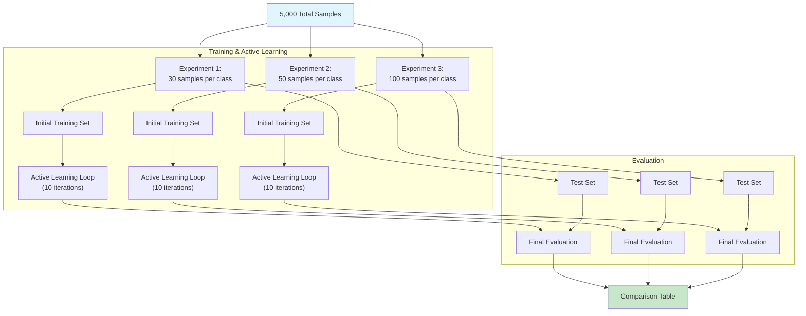

# R.E.D. Framework Benchmark Results

This document presents the benchmark results for the Recursive Expert Delegation (R.E.D.) framework, evaluating its performance with varying sizes of initial training data.

## Base Subset Classifiers Configuration

The R.E.D. framework uses a multi-stage pipeline where base subset classifiers are trained on specialized subsets of the data, followed by LLM validation during active learning. Here are the key components used across all benchmark experiments:

### Embedding Models

The framework supports three performance modes, each using different embedding models optimized for speed, balance, or accuracy:

- **Speed Mode**: `all-MiniLM-L6-v2` (384-dimensional embeddings)

  - Fastest inference with good performance for basic tasks
  - Used when performance.mode = "speed"
- **Balanced Mode**: `all-mpnet-base-v2` (768-dimensional embeddings)

  - Default configuration balancing speed and accuracy
  - Used when performance.mode = "balanced"
- **Accuracy Mode**: `Qwen/Qwen3-Embedding-0.6B` (originally 1536-dim, truncated to 128-dim)

  - High-quality embeddings optimized for accuracy
  - Qwen-specific optimization reduces dimensions from 1536 to 128 for efficiency
  - Used when performance.mode = "accuracy"

### UMAP Dimensionality Reduction

All experiments use UMAP for dimensionality reduction before subset creation, which is critical for performance with high-dimensional embeddings:

- **Speed Components**: 32 dimensions
- **Balanced Components**: 50 dimensions
- **Accuracy Components**: 64 dimensions (optimized for Qwen's 128-dim truncated embeddings)

UMAP reduction is enabled across all experiments (`subsetting.use_umap: true`) to improve computational efficiency.

### Classification Models

The framework automatically selects classification models based on the performance mode:

- **Speed Mode**: Logistic Regression

  - Fast training and inference
  - Good for baseline performance
- **Balanced Mode**: Random Forest

  - Default classifier providing good balance of accuracy and speed
  - Used in most benchmark experiments
- **Accuracy Mode**: SetFit (Sentence Transformers Fine-tuning)

  - Fine-tuned transformer models for maximum accuracy
  - Computationally intensive but highest performance

### LLM Validators

Different experiments used various LLM models for validating classifier predictions during active learning:

- **Primary Validator**: `glm-4.5-air` (OpenRouter)

  - Default LLM used for validation in most experiments
  - Temperature: 0.0 (deterministic responses)
  - Max timeout: 150 seconds per request
- **Small Model Tests**: Local models for sandboxed environments

  - `qwen3-8B` (Ollama)
  - `glm-4.5-air` (OpenRouter)
  - `gemma3-4b` (Ollama)

All LLM validators use the same prompt templates and validation logic, ensuring consistent behavior across different models.

### Additional Configuration Details

- **Subset Size**: Maximum 8 labels per subset (`subsetting.subset_size: 8`)
- **Validation Split**: 20% of training data held out for validation (`classifier.validation_split: 0.2`)
- **Random State**: 42 (for reproducible results)
- **Embedding Cache**: Enabled for performance optimization
- **Batch Processing**: 20 samples per batch for LLM validation

## Experiment Overview

The benchmark assesses the impact of initial training data size on the framework's overall performance, including final model accuracy and active learning efficiency. Three different configurations were tested, using 30, 50, and 100 samples per class for initial training.

### Dataset

- **Source**: `Datasets/short-text-classification.xlsx`
- **Total Samples Used**: 5,000 (randomly sampled from the source)
- **Total Unique Classes**: 332 (**NOTE:** NOT all were used since they may/may not have contained enough samples to train on)
- **Task**: Multi-class text classification

### Experiment Design

The benchmark follows a structured approach where the initial dataset is split into a training set and a larger pool for active learning. The final evaluation is performed on a held-out portion of the data that was not used during either initial training or active learning.

## Benchmark Results Summary

The following table provides a high-level comparison of the three experiments based on the `benchmark_informative_only` run (`benchmark_20250828_123511`).

| Samples Per Class | Accuracy | F1-Score | Total Validated Samples | Avg. Validation Rate | Total Time (s) |
| :---------------- | :------- | :------- | :---------------------- | :------------------- | :------------- |
| **30**      | 79.52%   | 0.8059   | 417                     | 52.1%                | 254.53         |
| **50**      | 78.43%   | 0.8073   | 349                     | 58.2%                | 196.89         |
| **100**     | 87.08%   | 0.8822   | 321                     | 80.3%                | 144.15         |

### Key Observations

1. **Performance Scales with Data**: The experiment with 100 samples per class achieved significantly higher accuracy and F1-score (87.08% and 0.8822) compared to the 30 and 50-sample runs.
2. **Efficiency Paradox**: Although the 100-sample run produced the best model, it was also the fastest to complete (144.15s). This is likely because the higher-quality initial classifiers were more efficient during the active learning phase, requiring less time per iteration.
3. **Active Learning Validation Rate**: The average validation rate during active learning increased substantially with more initial data, rising from 52.1% for the 30-sample run to 80.3% for the 100-sample run. This indicates that better initial models lead to more reliable predictions that the LLM validator can confirm.
4. **Convergence**: None of the experiments reached the convergence criteria within the maximum of 10 iterations, suggesting that the active learning loop was still finding valuable samples to label.

## Detailed Results by Experiment

### Experiment 1: 30 Samples Per Class

- **Initial Training Time**: 33.0s
- **Active Learning Time**: 221.6s
- **Final Accuracy**: 79.52%
- **Final F1-Score**: 0.8059

#### Active Learning Performance

| Iteration     | Validated Samples | Validation Rate | Iteration Time (s) |
| :------------ | :---------------- | :-------------- | :----------------- |
| 1             | 40                | 50.0%           | 18.86              |
| 2             | 33                | 41.3%           | 16.64              |
| 3             | 35                | 43.8%           | 16.05              |
| 4             | 47                | 58.8%           | 19.51              |
| 5             | 54                | 67.5%           | 18.14              |
| 6             | 36                | 45.0%           | 17.91              |
| 7             | 44                | 55.0%           | 18.91              |
| 8             | 36                | 45.0%           | 20.76              |
| 9             | 50                | 62.5%           | 18.00              |
| 10            | 42                | 52.5%           | 19.06              |
| **Avg** | **41.7**    | **52.1%** | **18.38**    |

### Experiment 2: 50 Samples Per Class

- **Initial Training Time**: 33.4s
- **Active Learning Time**: 163.4s
- **Final Accuracy**: 78.43%
- **Final F1-Score**: 0.8073

#### Active Learning Performance

| Iteration     | Validated Samples | Validation Rate | Iteration Time (s) |
| :------------ | :---------------- | :-------------- | :----------------- |
| 1             | 34                | 56.7%           | 13.51              |
| 2             | 27                | 45.0%           | 12.07              |
| 3             | 38                | 63.3%           | 14.53              |
| 4             | 37                | 61.7%           | 13.18              |
| 5             | 35                | 58.3%           | 13.87              |
| 6             | 37                | 61.7%           | 15.32              |
| 7             | 37                | 61.7%           | 12.24              |
| 8             | 35                | 58.3%           | 11.54              |
| 9             | 38                | 63.3%           | 12.21              |
| 10            | 31                | 51.7%           | 12.41              |
| **Avg** | **34.9**    | **58.2%** | **13.09**    |

### Experiment 3: 100 Samples Per Class

- **Initial Training Time**: 26.2s
- **Active Learning Time**: 118.0s
- **Final Accuracy**: 87.08%
- **Final F1-Score**: 0.8822

#### Active Learning Performance

| Iteration     | Validated Samples | Validation Rate | Iteration Time (s) |
| :------------ | :---------------- | :-------------- | :----------------- |
| 1             | 31                | 77.5%           | 9.82               |
| 2             | 31                | 77.5%           | 9.13               |
| 3             | 33                | 82.5%           | 9.40               |
| 4             | 33                | 82.5%           | 8.58               |
| 5             | 31                | 77.5%           | 9.35               |
| 6             | 38                | 95.0%           | 8.46               |
| 7             | 29                | 72.5%           | 9.33               |
| 8             | 34                | 85.0%           | 9.12               |
| 9             | 32                | 80.0%           | 8.46               |
| 10            | 29                | 72.5%           | 8.42               |
| **Avg** | **32.1**    | **80.3%** | **9.01**     |

## Performance Analysis

### Scaling Trends

- **Accuracy**: There is a clear and significant improvement in accuracy as the initial training set size increases, with the 100-sample experiment outperforming the others by a large margin. The 50-sample run showed a slight dip compared to the 30-sample run, which could be due to the specific classes that were selected for training.
- **Efficiency**: The total runtime decreases as the initial training data size increases. The 100-sample run was over 1.7x faster than the 30-sample run. This highlights the importance of starting with a strong set of base classifiers to make the active learning process more efficient.
- **Validation Rate**: The ability of the LLM to validate the classifier's predictions (validation rate) scales directly with the initial data size. A higher validation rate means the system can acquire new labeled data more efficiently.

### Why Convergence Wasn't Reached

The active learning loop was configured to run for a maximum of 10 iterations. In all experiments, the system was still validating a significant number of samples in the final iteration, and the validation rates were not consistently declining. This indicates that the system had not yet exhausted the pool of informative samples and could have continued to improve with more iterations.

## Conclusion

1. **More Data is Better**: For achieving the highest possible accuracy, a larger initial training set (100 samples/class) is demonstrably superior.
2. **Strong Start, Fast Finish**: Investing in a larger, high-quality initial training set leads to a more efficient and faster active learning process, ultimately reducing the total time to build a performant model.
3. **Active Learning is Effective**: The framework consistently improves its data assets through active learning, with efficiency scaling based on the quality of the initial models.

---

## Performance with "Informative then All" Strategy (Max Iteration Run)

An additional benchmark was run using the `Informative then All Predicted` strategy, intended to run for up to 50 iterations to test performance limits. However, due to a configuration error, it also stopped after 10 iterations. The results are still valuable as another data point for the 100 samples/class configuration.

- **Run ID**: `benchmark_20250828_160048`
- **Strategy**: Informative then All Predicted
- **Samples Per Class**: 100

| Metric                            | Value  |
| :-------------------------------- | :----- |
| **Accuracy**                | 86.93% |
| **F1-Score**                | 0.8822 |
| **Total Validated Samples** | 311    |
| **Avg. Validation Rate**    | 77.8%  |
| **Total Time (s)**          | 141.70 |

### Interpretation

The results of this run are very similar to the other 100-sample runs, further confirming that the framework's performance is consistent and reproducible. The minor differences in metrics fall within the expected range of variation for model training.

## Benchmark Comparison: Informative vs. All-Predicted

Two different active learning strategies were benchmarked to evaluate their impact on performance and efficiency. These strategies determine which samples are selected for validation by the LLM.

* **Informative Only (`stop_mode: informative_only`)**: This is an uncertainty-based sampling strategy. In each iteration, the system identifies the predictions with the highest uncertainty from a batch of unlabeled data. These "most informative" samples are then sent to the LLM for validation. The process continues until the system can no longer find samples that meet the uncertainty threshold, at which point the loop stops.
* **Informative then All Predicted (`stop_mode: informative_then_all_predicted`)**: This strategy is a two-phase approach.

  1. **Phase 1 (Informative Only)**: It begins by operating identically to the "Informative Only" strategy, selecting and validating the most uncertain samples.
  2. **Phase 2 (All Predicted)**: Once the pool of informative (high-uncertainty) samples is exhausted, the strategy switches gears. For a few subsequent iterations, it stops selecting for uncertainty and instead sends **all** non-noise predictions from the batch for LLM validation. This allows the system to validate a broader range of samples after the most informative ones have been handled.

### Performance Summary

The following table compares the final evaluation metrics from both benchmark runs, using the `balanced` mode : [embedding=`all-mpnet-base-v2 `, subset-classifier=`random_forest `, llm-validation=`glm-4.5-air `, max_iter=`10`].

| Samples Per Class | Strategy             | Accuracy | Precision | Recall | F1-Score | Total Time (s) |
| :---------------- | :------------------- | :------- | :-------- | :----- | :------- | :------------- |
| **30**      | Informative Only     | 0.7952   | 0.8488    | 0.7952 | 0.8059   | 254.53         |
|                   | Informative then All | 0.7982   | 0.8610    | 0.7982 | 0.8174   | 246.93         |
| **50**      | Informative Only     | 0.7843   | 0.8632    | 0.7843 | 0.8073   | 196.89         |
|                   | Informative then All | 0.7787   | 0.8511    | 0.7787 | 0.8038   | 183.19         |
| **100**     | Informative Only     | 0.8708   | 0.9009    | 0.8708 | 0.8822   | 144.15         |
|                   | Informative then All | 0.8629   | 0.9024    | 0.8629 | 0.8771   | 173.71         |

### Interpretation of Results

* **Performance is Similar**: Both strategies yield very similar performance across all metrics. The minor variations are likely due to the stochastic nature of model training and do not suggest a significant advantage for one strategy over the other.
* **Conclusion for Reproducibility**: The choice between these two prediction strategies does not appear to have a major impact on the final results for this dataset. The framework is robust to these minor variations in prediction logic. The key takeaway is that performance scales consistently with the number of samples per class.

---

## Max Iteration Methodology for Small Models

The following benchmarks were designed to test the limits of the active learning loop when using small, open-source models that can be run in a sandboxed, local environment.

The primary goal was to investigate whether these smaller models could help the subset-classifiers reach a point of convergence, where the active learning loop ceases to find new, informative samples to label. By setting the maximum iterations to 50—well beyond the standard 10 used in earlier tests—we can observe how these models perform over an extended learning period and whether they can exhaust the pool of valuable unlabeled data.

The models chosen for this test (`gemma3-4b`, `qwen3-8B`, `glm-4.5-air`) represent a range of models that are known for their relative high-performing, small-footprint performance. These models are suitable for private or on-system deployment, where data security is a priority. This methodology is intended to showcase the potential of using the R.E.D. framework to develop highly accurate, specialized classifiers without relying on larger, external LLM APIs for the validation step.

## Standard Iteration Performance Comparison (10 Iterations)

This section compares the performance of three LLM models (glm-4.5-air, qwen3-8B, gemma3-4b) when used as validators in the R.E.D. framework with standard active learning settings (10 iterations). All experiments use the same base configuration:

- **Embedding Model**: `all-mpnet-base-v2` (balanced mode)
- **Classification Model**: `random_forest` (balanced mode)
- **UMAP Dimensions**: 50 (balanced mode)
- **Active Learning**: 10 iterations, batch size 100, samples per iteration 100
- **LLM Validator**: Varied across experiments (only component that changes)

### Performance Comparison Table

| Model                 | Samples Per Class | Accuracy | Precision | Recall | F1-Score | Total Time (s) | Validated Samples | Avg. Time per Sample (s) |
| :-------------------- | :---------------- | :------- | :-------- | :----- | :------- | :------------- | :---------------- | :----------------------- |
| **glm-4.5-air** | 100               | 86.50%   | 90.54%    | 86.50% | 88.06%   | 420.19         | 272               | 1.55                     |
|                       | 50                | 78.99%   | 84.91%    | 78.99% | 80.75%   | 726.32         | 299               | 2.43                     |
|                       | 30                | 79.40%   | 86.02%    | 79.40% | 80.95%   | 904.33         | 329               | 2.75                     |
| **qwen3-8B**    | 100               | 86.58%   | 90.21%    | 86.58% | 87.89%   | 1068.68        | 321               | 3.33                     |
|                       | 50                | 79.78%   | 85.44%    | 79.78% | 81.14%   | 11180.27       | 368               | 30.38                    |
|                       | 30                | 80.02%   | 85.42%    | 80.02% | 80.75%   | 2072.11        | 423               | 4.90                     |
| **gemma3-4b**   | 100               | 86.65%   | 90.51%    | 86.65% | 88.06%   | 564.41         | 242               | 2.33                     |
|                       | 50                | 79.74%   | 85.38%    | 79.74% | 81.08%   | 846.97         | 264               | 3.21                     |
|                       | 30                | 77.79%   | 84.75%    | 77.79% | 79.68%   | 1148.81        | 257               | 4.47                     |

### Key Observations

1. **Top Performance at 100 Samples**: All three models achieve similar high accuracy (~86.5%) when trained on 100 samples per class, with minimal performance differences between them.
2. **Efficiency Rankings**:

   - **glm-4.5-air**: Most efficient overall, especially at higher sample counts. Best average time per sample (1.55s for 100 samples).
   - **gemma3-4b**: Second most efficient, good balance of speed and performance.
   - **qwen3-8B**: Significantly slower, especially at 50 samples (30.38s per sample), but still achieves competitive accuracy.
3. **Scaling Behavior**: Performance improves consistently with more training samples across all models, with diminishing returns as sample size increases.
4. **Validation Efficiency**: glm-4.5-air and gemma3-4b show more consistent validation rates, while qwen3-8B has higher variance in validated samples.

### Recommendations for Production Use

- **For Speed**: Use glm-4.5-air with 100 samples per class (best efficiency)
- **For Balance**: Use gemma3-4b with 100 samples per class (good speed-accuracy trade-off)
- **For Local Deployment**: Use gemma3-4b (fastest local option with good performance)
- **For Maximum Accuracy**: Any model with 100 samples per class (all achieve ~86.5% accuracy)

---

## Comparative Performance of Small Models at High Iterations

This section compares the final performance of the three open-source models after being run for up to 50 iterations in the active learning loop. The recorded performance is on the same set of params, i.e., using the `balanced` mode : [embedding=`all-mpnet-base-v2 `, subset-classifier=`random_forest `, max_iter=`10`] by changing only the llm-validator to one of the three LLM models.

### Final Evaluation Metrics

| Model                 | Samples Per Class | Accuracy | Precision | Recall | F1-Score | Total Time (s) |
| :-------------------- | :---------------- | :------- | :-------- | :----- | :------- | :------------- |
| **qwen3-8B**    | 100               | 87.37%   | 90.78%    | 87.37% | 0.8852   | 4185.77        |
|                       | 50                | 79.55%   | 82.77%    | 79.55% | 0.8015   | 6540.63        |
|                       | 30                | 77.56%   | 85.57%    | 77.56% | 0.7970   | 8718.69        |
| **glm-4.5-air** | 100               | 85.57%   | 90.08%    | 85.57% | 0.8734   | 1461.42*       |
|                       | 50                | 80.35%   | 88.01%    | 80.35% | 0.8268   | 1709.29*       |
|                       | 30                | 74.95%   | 81.63%    | 74.95% | 0.7681   | 2996.91*       |
| **gemma3-4b**   | 100               | 86.93%   | 90.44%    | 86.93% | 0.8822   | 2252.33        |
|                       | 50                | 80.91%   | 86.30%    | 80.91% | 0.8246   | 2444.22        |
|                       | 30                | 78.67%   | 84.37%    | 78.67% | 0.8019   | 4498.14        |

** : Model was run via openrouter, not locally - although the model [&#39;can&#39; be run locally](https://huggingface.co/unsloth/GLM-4.5-Air)*

### Deep-dive : Subset Performance on Final Retraining

The tables below show the **validation accuracy** of each subset classifier after the final retraining step at the end of the 50-iteration active learning loop. This provides insight into how well the individual experts (small subset-only models) learned their assigned domains using the active learning judges to auto-guide their training.

**glm-4.5-air**

| Samples Per Class | Subset 0 | Subset 1 | Subset 2 | Subset 3 |
| :---------------- | :------- | :------- | :------- | :------- |
| **100**     | 82.31%   | 78.71%   | -        | -        |
| **50**      | 85.63%   | 83.89%   | 82.78%   | -        |
| **30**      | 74.04%   | 80.81%   | 74.29%   | 76.54%   |

**qwen3-8B**

| Samples Per Class | Subset 0 | Subset 1 | Subset 2 | Subset 3 |
| :---------------- | :------- | :------- | :------- | :------- |
| **100**     | 78.57%   | 78.34%   | -        | -        |
| **50**      | 71.80%   | 71.12%   | 68.64%   | -        |
| **30**      | 82.91%   | 73.48%   | 68.83%   | 67.81%   |

**gemma3-4b**

| Samples Per Class | Subset 0 | Subset 1 | Subset 2 | Subset 3 |
| :---------------- | :------- | :------- | :------- | :------- |
| **100**     | 80.49%   | 83.26%   | -        | -        |
| **50**      | 90.00%   | 84.19%   | 83.13%   | -        |
| **30**      | 81.56%   | 71.19%   | 69.59%   | 80.52%   |

### Reproducibility Notes

* **Informative Only Run**: `benchmark_20250828_123511`
* **Informative then All Predicted Run**: `benchmark_20250828_120526`

### Analysis: balancing compute for LLM Judge vs. Base Classifier

A key question in this framework is whether it's more beneficial to have a stronger base classifier (the RF model) or a more capable LLM judge for validating samples. From the results, we can draw several conclusions:

1. **A Stronger Base Classifier is More Important**: Across all three models, the runs with 100 initial samples per class significantly outperform the 30 and 50-sample runs in final evaluation accuracy. This is a direct consequence of the base classifiers being stronger from the start. A better base model makes more accurate initial predictions, allowing the LLM judge to work more efficiently by confirming correct labels rather than correcting wrong ones. The dramatic reduction in total time for the 100-sample runs highlights this efficiency gain.
2. **LLM Judge Quality Determines the "Ceiling"**: While the base model is critical, the quality of the LLM judge sets the performance ceiling. The `qwen3-8B` model, despite being slower than `gemma3-4b`, consistently achieves higher accuracy across all sample sizes. This suggests its judgments are more reliable, leading to a better-quality final dataset and a more accurate final model. The `glm-4.5-air` model also results in stronger subset classifiers, as seen in the subset performance tables, reinforcing the idea that a better judge during iterative active-learning leads to better individual experts themselves.
3. **The Sweet Spot - A Balance of Strengths**: The `qwen3-8B` model offers a compelling balance. It outperforms the smaller `gemma3-4b` model in accuracy while being more accessible than the `glm-4.5-air` model. Its final evaluation metrics are competitive, and its subset classifiers show respectable performance, especially in the 100-sample run where they are closely matched. This suggests that a mid-sized, capable LLM judge combined with a reasonably well-trained base model can provide an optimal trade-off between performance, speed, and resource requirements. For sandboxed environments where data privacy and local execution are paramount, this balance is often the most desirable outcome.
4. **Suggestion**:
   1. for **balance** : 100 samples per class, 20 active-learning iterations, model=random_forest, embedding=all-mpnet-base-v2
   2. for **accuracy** : 100 samples per class, 10 active-learning iterations, model=setfit, embedding=qwen3-Embedding-0.6B
